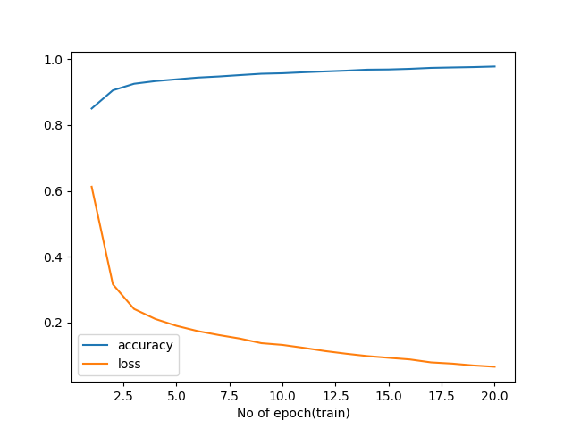
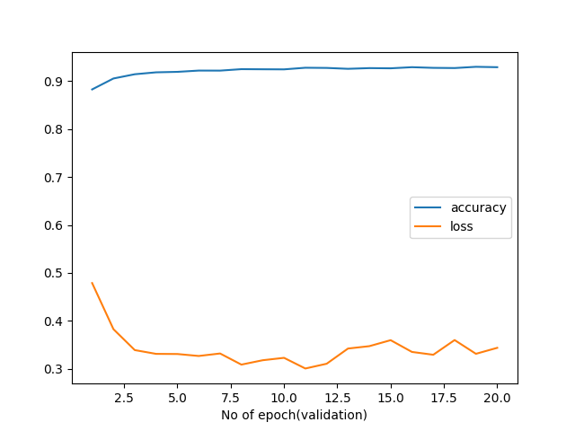

# Person Name Extraction (Bengali)

## __Introduction:__  

   In the Project, we are about to perform Person Name Extraction using the custom deep learning model.
   > The dataset that we have used in this project can be downloaded from the 
   > given [Link](https://github.com/Rifat1493/Bengali-NER/tree/master/annotated%20data).

## __Dataset Description:__
The dataset is a Bengali Name Entity Extraction (NER) dataset which contains **8** different
entities namely,  
> `['O', 'B-LOC', 'B-PER', 'I-PER', 'I-ORG', 'B-ORG', 'TIM', 'I-LOC']`.  

Dataset format is `text` file where each line in the file contains a word with their
corresponding tag. Follow the below example:
```text
ছেলে	O
মো	B-PER
.	I-PER
মনিরুল	I-PER
অপ্রকৃতিস্থ	O
।	O
```
There are two `text` files in the dataset. One is `train_data.txt` and the other one is `test_data.txt`.


## __Project Description__

Root directory of this project contains:
>
> - **5 sub-folders**
> - **several [.py] files**
> - **several text files containing all the data and requirements of this project**
> - **1 readme.md file containing all the necessary instructions.**
> - **1 CSV file containing stop words for bengali language.**

Details about the folders and files:
 >
 > - **checkpoint(folder):**  Contains the checkpoint and trained model which will be used to test or evaluate our model.  
 > - **dataset(folder):** Contains our **train and test** data.
 > - **output(folder):** Contains training and validation curves along with the training summary.
 > - **notebooks(folder):** Some r&d notebooks which we had done while starting the project.
 > - **src(folder)**: Contains all the source codes for this project. This folder contains:  
 >
 > - **data(package)**: Contains the following files:
 >
 >> - **\_\_init__.py**
 >> - **config.py**: Our initial file and path configuration for this project.
 >> - **dataloader.py**: This script will be used to create the vocabulary with our dataset and build our dataloader.
 >> - **processor.py**: Before build our dataloader we need to process our dataset and make the right format for the desired output so that this dataset can be used to train with.
 >
 > - **models(package)**: Contains the following files:
 >
 >> - **\_\_init__.py**
 >> - **model.py**: Contains our custom build model which will used in model training.
 >> - **NER.py**: This script will be used for providing us with the different helping functionalities to train the model.
 >
 > - **\_\_init__.py**  
 > - **build_dataloader.py**: Will be used to build our dataloader.
 > - **processing.py**: Will be used to process our data.
 > - **train.py**: Will be used to initialize and train our model.
 > - **evaluate.py**: Evaluate our model with test data.
 > - **inference.py**: We can test our model for a single given sentence.

### __Project intuition:__

> In this project, our main intuition is to extract person name entity with the 
> trained model from a given bengali sentence. The first step that we need to do 
> is to look at our dataset. Getting more information regarding data and data 
> distribution. To do that  first we convert our dataset into `csv` format because 
> it will make our data exploration and modification much easier. After exploring data
> for a bit, we apply some of the necessary transformations on our data so that our
> data become ready to train. We removed unnecessary `punctuations` for our dataset. At first, we
> removed all the `stopwords` from the data as well but the model accuracy dropped in that 
> particular case. This is most likely that the `stopwords` help to extract the contextual
> meaning of the sentences. So keeping the stopwords as it is, will be better. After doing all the
> modifications on the data we stored the data as `tsv` format.  
>
> We have used `SequenceTaggingDataset` from `torchtext.datasets` to define our
> train, validation and test dataset.
> > - `SequenceTaggingDataset` defines a dataset for sequence tagging.
> > - As our each line in our dataset contains a pair of word and tag, it will be
> > more suitable.  
>
> To build our data iterator we have used `BucketIterator` from `torchtext.data`
> > - It defines iterator that batches examples of similar lengths together.
> > - Minimizes amount of padding needed while producing freshly shuffled batches for each new epoch.
>
> While building the model, our main focus was to build a computational efficient 
> model to extract the person names. There are several state of the arts models that
> already exist for example `bert` based model which can be fine-tuned and get good results.
> But then require high computational power and GPU to train these models.
> > - We have conducted some r&ds to fine-tune different bert-based models with
> our dataset. 
> > - We have fine-tuned, evaluated and tested with the fine-tuned model.
> > - Notebook regarding this r&d can be found in `notebooks` folder named `bangla_NER.ipynb`.  
>
> Then we decided to build our custom model with deep neural network and in this 
> particular project `biLSTM` with pretrained bangla `word2vec` have been used to train 
> the model. The main reasons to choose `biLSTM` over other models are,
> > - Other CNN  or RNN models are not that much capable to catch long term or
  contextual dependencies like bilstm.
> > - Unlike standard LSTM, the information flows in both directions
> > - It’s capable of utilizing information from both sides.
> > - It provides good results on capturing sequential dependencies 
>  between words and phrases in both directions of the sequence.
> > - Pretrained `word2vec` model is used while initializing the model
>  embeddings because it will help capture meaning of the similar words.
> > - Without using pretrained `word2vec` was also experimented. But using the
>  model provides better result.
> 
> 
### __Instructions:__

To run this project please follow the instructions below:

> __Python version__ : `3.8.10`

> First of all we need to satisfy all the dependencies. For that reason need to execute the following command. (All the commands need to be executed from the root folder)
>
> - __Install the dependencies:__
    `pip install -r requirements.txt`  

> Before start the training we need to process our dataset into the correct format. To do that execute the following command:
>
> - __To process the dataset:__
    `python src/processing.py`  

> Now we can start training our model. There are two approach that we can use to train.
> >
> > - Without pretrained Word2Vec embedding
> > - With pretrained Word2Vec embedding 
>  
> There are also some hyperparameters that we can set during training.
> >
> > - Embedding dimension (For pretrained word2vec it will be 300)
> > - Hidden dimension
> > - No. of Bi-LSTM layers
> > - Embedding dropout
> > - Bi-LSTM dropout
> > - FC layer dropout
> > - No. of epoch
> > - If we want to train with word2vec or not(1/0).

> To start the training: 
 >
 > - __To train the model__  
  `python src/train.py --emd 256 --hidden 128 --lstm 2 --em_drop 0.30 --lstm_drop 0.20 --fc_drop 0.30 --epoch 20 --w2v 1`
 
> - __To evaluate the trained model with test data:__  
> `python src/evaluate.py`
>

> - __Test the model with a single sentence:__  
> `python src/inference.py` 

>
> [N.B: The pretrained bangla __word2vec__ model that is used in this project can be
> downloaded from this [Link](https://drive.google.com/file/d/11xhgSz6-NLohgyvxdPSXeBuaBy_l0ygS/view). 
> After exacting the model, **bn_w2v_model.text** file must be kept in the root project folder.]
>
## Inference

> The accuracy score for our training and testing data:

|       	| **Loss**  	| **Accuracy** 	|
|-------	|-----------	|--------------	|
| Train 	| **0.065** 	| **97.84**    	|
| Test  	| **0.677** 	| **92.85**    	|

> Detailed scores for testing data:

|      	|    Loss   	| Accuracy(%) 	| Precision(%) 	| Recall(%) 	| F1_Score(%) 	|
|:----:	|:---------:	|:-----------:	|:------------:	|:---------:	|:-----------:	|
| Test 	| **0.677** 	|  **92.85**  	|   **92.36**  	| **92.85** 	|  **92.02**  	|

__Training curve:__





__Extracted names from the pretrained model:__
```text
input = "মুনীর চৌধুরী এবং তানভীর হোসেন ছোটবেলার বন্ধু।"
output =  ['মুনীর চৌধুরী', 'তানভীর হোসেন']

input = "সাইদুল সাহেব কাস্টমারকে একশ টাকা বাকি দিলেন।"
output = ['সাইদুল']

input = "আজ রাতে কোন রূপকথা নয়!"
output = ['']

```
